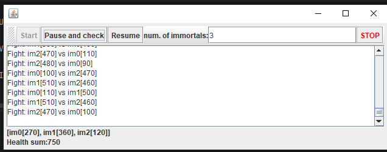
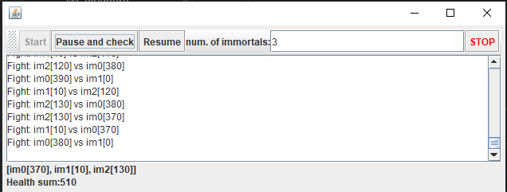
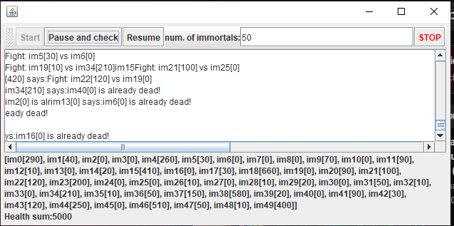
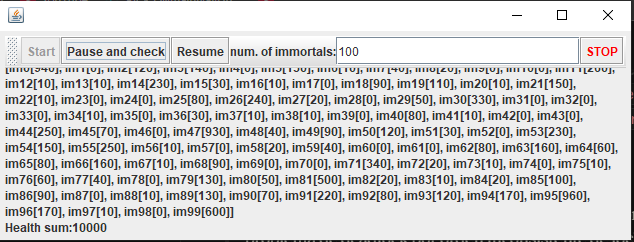
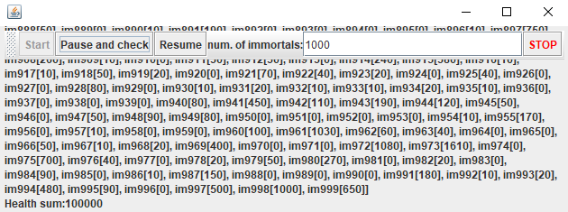
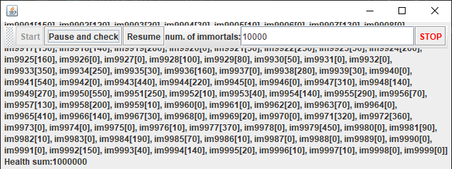
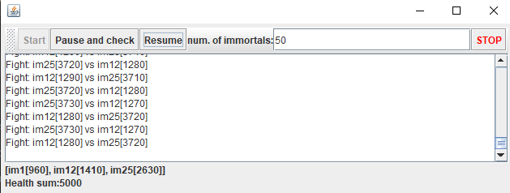
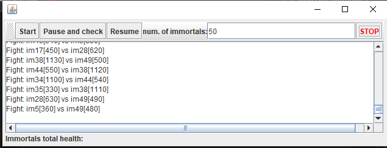

## Escuela Colombiana de Ingeniería
### Arquitecturas de Software – ARSW


#### Ejercicio – programación concurrente, condiciones de carrera y sincronización de hilos. EJERCICIO INDIVIDUAL O EN PAREJAS.

### Juan Manuel Lopez Barrera - Laura Santiago

##### Parte I – Antes de terminar la clase.

Control de hilos con wait/notify. Productor/consumidor.

1. Revise el funcionamiento del programa y ejecútelo. Mientras esto ocurren, ejecute jVisualVM y revise el consumo de CPU del proceso correspondiente. A qué se debe este consumo?, cual es la clase responsable?
2. Haga los ajustes necesarios para que la solución use más eficientemente la CPU, teniendo en cuenta que -por ahora- la producción es lenta y el consumo es rápido. Verifique con JVisualVM que el consumo de CPU se reduzca.
3. Haga que ahora el productor produzca muy rápido, y el consumidor consuma lento. Teniendo en cuenta que el productor conoce un límite de Stock (cuantos elementos debería tener, a lo sumo en la cola), haga que dicho límite se respete. Revise el API de la colección usada como cola para ver cómo garantizar que dicho límite no se supere. Verifique que, al poner un límite pequeño para el 'stock', no haya consumo alto de CPU ni errores.


##### Parte II. – Antes de terminar la clase.

Teniendo en cuenta los conceptos vistos de condición de carrera y sincronización, haga una nueva versión -más eficiente- del ejercicio anterior (el buscador de listas negras). En la versión actual, cada hilo se encarga de revisar el host en la totalidad del subconjunto de servidores que le corresponde, de manera que en conjunto se están explorando la totalidad de servidores. Teniendo esto en cuenta, haga que:

- La búsqueda distribuida se detenga (deje de buscar en las listas negras restantes) y retorne la respuesta apenas, en su conjunto, los hilos hayan detectado el número de ocurrencias requerido que determina si un host es confiable o no (_BLACK_LIST_ALARM_COUNT_).
- Lo anterior, garantizando que no se den condiciones de carrera.

##### Parte III. – Avance para el martes, antes de clase.

Sincronización y Dead-Locks.


1. Revise el programa “highlander-simulator”, dispuesto en el paquete edu.eci.arsw.highlandersim. Este es un juego en el que:

	* Se tienen N jugadores inmortales.
	* Cada jugador conoce a los N-1 jugador restantes.
	* Cada jugador, permanentemente, ataca a algún otro inmortal. El que primero ataca le resta M puntos de vida a su contrincante, y aumenta en esta misma cantidad sus propios puntos de vida.
	* El juego podría nunca tener un único ganador. Lo más probable es que al final sólo queden dos, peleando indefinidamente quitando y sumando puntos de vida.

2. Revise el código e identifique cómo se implemento la funcionalidad antes indicada. Dada la intención del juego, un invariante debería ser que la sumatoria de los puntos de vida de todos los jugadores siempre sea el mismo(claro está, en un instante de tiempo en el que no esté en proceso una operación de incremento/reducción de tiempo). Para este caso, para N jugadores, cual debería ser este valor?.

	La invariante se encuentra dentro de fight
	"i2.changeHealth(i2.getHealth() - defaultDamageValue);" y "this.health += defaultDamageValue;"
	Siendo asi comenzamos con un numero N de inmortales y cada uno con una vida que se define en una variable dentro
	del control en este caso base de 100, asi el invariante seria la suma total N * valorDeVidaMaxima ya que independientemente
	que uno muera o se peguen la vida no "desaparece" sino que se suma a la del atacante por lo que deberia ser una constante

	

3. Ejecute la aplicación y verifique cómo funcionan las opción ‘pause and check’. Se cumple el invariante?.

	
	
	como se puede observar en la imagen la vida que deberia permanecer constante aumento de lo estipulado N = 3 Vida = 100 total = 300
	sin embargo, dio 750 por lo que la invariante se rompio, como segunda observación  el boton de pause and check solamente le funciona el "check"
	ya que el programa siguio corriendo.
	

4. Una primera hipótesis para que se presente la condición de carrera para dicha función (pause and check), es que el programa consulta la lista cuyos valores va a imprimir, a la vez que otros hilos modifican sus valores. Para corregir esto, haga lo que sea necesario para que efectivamente, antes de imprimir los resultados actuales, se pausen todos los demás hilos. Adicionalmente, implemente la opción ‘resume’.

	

	Lo primero que realizamos para poder solucionar este error fue la creacion de un controlador para la pausa
	con 3 funciones pauseAndAwaitAll hasta que el total de pausas y de hilos sea iguales asi el check no leera la lista
	hasta que todos los hilos esten detenidos.

	Checkpoint este metodo esta diseñado para que cada inmortal verificando en loop si la flag de paused es verdadera
	contandose asi mismo y despierta a los demas checkpoins para que queden en el bloqueo de espera
	hasta que paused vuelva a ser falso.

	y resumeAll() para permitir hacer funcionar el boton de "resume"

	Y como todo se maneja sobre la misma instancia del monitor tanto para los hilos como el "juego" nos
	aseguramos que se mantenga sincronizado.

	se agrego un setter dentro de inmortal para tomar el control de pausa y en el run
	se le agrego el checkpoint mediante el llamado al controller

	por parte del controlframe se agrego el crear una instancia del controlador de pausa al darle start
	y se agrego la logica necesaria para el funcionamiento de resume y solucionar la pausa.


5. Verifique nuevamente el funcionamiento (haga clic muchas veces en el botón). Se cumple o no el invariante?.

   

   Y con eso los botones se encuentra operativos, sin embargo, cabe destacar que aun con los cambios implementados
	La invariante sigue rompiendose, en menor medida que antes ya que no da numeros tan grandes pero sigue sin cumplir.

6. Identifique posibles regiones críticas en lo que respecta a la pelea de los inmortales. Implemente una estrategia de bloqueo que evite las condiciones de carrera. Recuerde que si usted requiere usar dos o más ‘locks’ simultáneamente, puede usar bloques sincronizados anidados:

	```java
	synchronized(locka){
		synchronized(lockb){
			…
		}
	}
	```
 
	

	como se sugirio se uso una sincronizacion anidada para las region critica de fight era la propia pelea en general
	al momento de leer/modificar la vida de los 2 imortales.

	con ayuda del bloque cuando 2 inmortales se involucren en una pelea, se bloquean simultaneamente, asi el tercer hilo no puede
	modificar a cualquiera de los otros mientras dure la operacion, y para evitar un deadlock los locks se adquieren
	en un orden determinado por el nombre del mortal.

7. Tras implementar su estrategia, ponga a correr su programa, y ponga atención a si éste se llega a detener. Si es así, use los programas jps y jstack para identificar por qué el programa se detuvo.

	

	Tras la implementacion de lo mencionado el invariante se mantiene estable almenos con 50 inmortales 50 x 100 = 5000 tras varios pause and check y resume el numero de vida
	no cambio como deberia ser, por otra parte en ningun momento el programa se detuvo, por lo que no fue necesario recurrir a jps/jstack,
	ya que no se presentó un deadlock.

	cabe destacar que al varios hilos intentar hacer print al tiempo genera que los mismos se vean bastante "feos"


8. Plantee una estrategia para corregir el problema antes identificado (puede revisar de nuevo las páginas 206 y 207 de _Java Concurrency in Practice_).

	En este caso la estrategia para prevenir el deadlock fue el ordenamiento para la adquisicion consistente de locks
	se establecio un criterio de quien ataca a aquien comparando por los nombres de los inmortales "name.compareTo"
	y asi adquirir primero el lock con el "menor" nombre alfabeticamente asi los 2 locks de la "pelea" siempre se solicitan
	en la misma secuencia.

   
9. Una vez corregido el problema, rectifique que el programa siga funcionando de manera consistente cuando se ejecutan 100, 1000 o 10000 inmortales. Si en estos casos grandes se empieza a incumplir de nuevo el invariante, debe analizar lo realizado en el paso 4.
	
	
	
	

	

	Tras realizar varias pruebas como en el punto punto lo sugeria si bien con los 10000 hilos
	el programa se volvio un poco lento para iniciar y frenar la condicion del invariante se mantuvo constante y no cambio
	

10. Un elemento molesto para la simulación es que en cierto punto de la misma hay pocos 'inmortales' vivos realizando peleas fallidas con 'inmortales' ya muertos. Es necesario ir suprimiendo los inmortales muertos de la simulación a medida que van muriendo. Para esto:
	* Analizando el esquema de funcionamiento de la simulación, esto podría crear una condición de carrera? Implemente la funcionalidad, ejecute la simulación y observe qué problema se presenta cuando hay muchos 'inmortales' en la misma. Escriba sus conclusiones al respecto en el archivo RESPUESTAS.txt.
	* Corrija el problema anterior __SIN hacer uso de sincronización__, pues volver secuencial el acceso a la lista compartida de inmortales haría extremadamente lenta la simulación.
	
	-

	}

    Se cambio la linked list a una CopyOnwriteArrayList para que la remosion de inmortales muertos fuera segura
	sin necesidad de sincronizacion, al realizar pruebas pudimos notar como se generaron problemas adiccionales
	el primero fueron los zombies, al no tener una comprobacion de que la vida fuera menor o igual a 0 al inicio del ciclo
	los inmortales "muertos" intentaban seguir atacando, y el segundo fue una condiccion carrera donde un inmortal podia 
	morir y ser removido durante esa ventana de tiempo lo que lo hacia "revivir" y por consecuente volver a descuadrar la invariante
	se soluciono usando una verificacion de la salud dentro del segundo bloque sicronizado de fight.


11. Para finalizar, implemente la opción STOP.

	
	
	Para implementar el stop, se aprovecho el mecanismo que trae por defecto los hilos de java para interrumpirse
	cuando se le da al boton se llama interrupt sobre todos los inmortales activos
	y ya que cada uno de ellos usaba wait y thread.sleep cada hilo recibia un InterrupedExecepcion y salia	
	del bucle de forma limpia mediante un return terminando su ejecucion.

<!--
### Criterios de evaluación

1. Parte I.
	* Funcional: La simulación de producción/consumidor se ejecuta eficientemente (sin esperas activas).

2. Parte II. (Retomando el laboratorio 1)
	* Se modificó el ejercicio anterior para que los hilos llevaran conjuntamente (compartido) el número de ocurrencias encontradas, y se finalizaran y retornaran el valor en cuanto dicho número de ocurrencias fuera el esperado.
	* Se garantiza que no se den condiciones de carrera modificando el acceso concurrente al valor compartido (número de ocurrencias).


2. Parte III.
	* Diseño:
		- Coordinación de hilos:
			* Para pausar la pelea, se debe lograr que el hilo principal induzca a los otros a que se suspendan a sí mismos. Se debe también tener en cuenta que sólo se debe mostrar la sumatoria de los puntos de vida cuando se asegure que todos los hilos han sido suspendidos.
			* Si para lo anterior se recorre a todo el conjunto de hilos para ver su estado, se evalúa como R, por ser muy ineficiente.
			* Si para lo anterior los hilos manipulan un contador concurrentemente, pero lo hacen sin tener en cuenta que el incremento de un contador no es una operación atómica -es decir, que puede causar una condición de carrera- , se evalúa como R. En este caso se debería sincronizar el acceso, o usar tipos atómicos como AtomicInteger).

		- Consistencia ante la concurrencia
			* Para garantizar la consistencia en la pelea entre dos inmortales, se debe sincronizar el acceso a cualquier otra pelea que involucre a uno, al otro, o a los dos simultáneamente:
			* En los bloques anidados de sincronización requeridos para lo anterior, se debe garantizar que si los mismos locks son usados en dos peleas simultánemante, éstos será usados en el mismo orden para evitar deadlocks.
			* En caso de sincronizar el acceso a la pelea con un LOCK común, se evaluará como M, pues esto hace secuencial todas las peleas.
			* La lista de inmortales debe reducirse en la medida que éstos mueran, pero esta operación debe realizarse SIN sincronización, sino haciendo uso de una colección concurrente (no bloqueante).

	

	* Funcionalidad:
		* Se cumple con el invariante al usar la aplicación con 10, 100 o 1000 hilos.
		* La aplicación puede reanudar y finalizar(stop) su ejecución.
		
		-->

<a rel="license" href="http://creativecommons.org/licenses/by-nc/4.0/"></a><br />Este contenido hace parte del curso Arquitecturas de Software del programa de Ingeniería de Sistemas de la Escuela Colombiana de Ingeniería, y está licenciado como <a rel="license" href="http://creativecommons.org/licenses/by-nc/4.0/">Creative Commons Attribution-NonCommercial 4.0 International License</a>.
